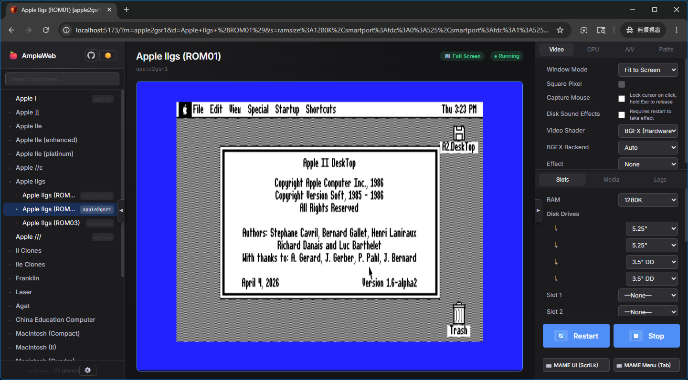

# [AmpleWeb](https://github.com/anomixer/ample/tree/ampleweb/AmpleWeb) - Browser Port (Apple Emulator Frontend)

[English](README.md) | [繁體中文](README_tw.md)

This is a pure browser-based port of the macOS native [Ample](https://github.com/ksherlock/ample) project, bringing the premium Apple II and Macintosh emulation experience to any modern web browser. Powered by WASM and React. Enjoy the nostalgic 198x-199x computing experience directly in your browser with zero installation of apps or ROM files.

> [!IMPORTANT]
> **Pure Client-Side**: AmpleWeb runs entirely in your browser. No backend, no server-side emulation, and zero installation required.

## 🍎 Ample (macOS) vs. AmpleWeb (Web) Comparison

| Feature | Ample (macOS Native) | AmpleWeb (Web) | Notes |
| :--- | :--- | :--- | :--- |
| **Language** | Objective-C (Cocoa) | **React + TypeScript (Vite)** | 1:1 UI replica using modern web standards |
| **Installation** | .dmg Image / Homebrew | **Zero Install (Web-based)** | Runs directly via URL |
| **MAME Integration** | Built-in Custom Core | **MAME WASM (Universal)** | High-performance Emscripten-compiled binary |
| **UI** | Native macOS Components | **Pixel-Perfect CSS Replica** | Includes **Dark/Light Mode** & Tab Persistence |
| **File System** | Native HFS/ProDOS Access | **VFS + Local Folder Mapping** | Support for mounting local folders via File System Access API |
| **Data Persistence** | Direct Disk Write | **Save-on-Eject Workflow** | Detects changes in VFS and prompts local save |
| **Video Support** | Metal / OpenGL / BGFX | **WebGL / BGFX WASM** | Full BGFX effects (CRT-Geom, Scanlines, etc.) |

## 🌟 Key Features

### 🍏 Faithful Experience (Feature Parity)
*   **Visual Precision**: Support for **Window 1x-4x** modes and **Full Screen** (Fit-to-Screen) scaling.
*   **Comprehensive Library**: Full support for **Apple I, II, III, and Macintosh** families.
*   **International Localization**: Proper support for localized **Apple IIe/IIee/IIep** variants (DE, FR, ES, SE, UK) with accurate character sets and boot logos.
*   **Peripheral Support**: Supports auto-injection for **SCSI, CFFA2, Mouse cards, and Memory expansion**.
*   **Dynamic ROM Management**: Automatically fetches required device ROMs (e.g., `a2mouse.zip`) for selected slot peripherals, preventing boot crashes.
*   **Advanced Video**: Integrated **BGFX screen chains** for authentic retro visuals. (Work in Progress)
*   **Personalized UI**: Full support for **Dark/Light Mode** switching, faithfully replicating the macOS native visual aesthetics.

### 🌐 Web-Specific Features
*   **Local Directory Mapping (/share)**: Map any local host folder directly to the emulator's VFS for seamless data exchange.
*   **Save back to Local**: Modified virtual disk images are automatically detected and prompted for download upon ejection.
*   **Capture Persistence**: Export generated **AVI video** and **WAV audio** captures directly to your local device (avoid long recordings to prevent browser memory buffer overflow).
*   **Deep Linking (Instant Sharing)**: Pre-configure machines, slots, and media via URL parameters; supports automatic startup (URL ending with `&autoboot`) for seamless demos and education.
*   **URL-Based Media Loading**: Mount disks directly from any external URL using the `?media=slotId:http://...` parameter or via the new **🌐 URL Button** in the Media tab.
*   **Automatic ZIP Unzipping**: Support for loading `.zip` disk images from URLs or local selection. Automatically extracts valid images (.dsk, .do, .po, etc.) for mounting.
*   **Recursive Device Dependencies**: Automatically resolves sub-dependencies for slot peripherals (e.g., `a2mouse` needing `m68705p3`).
*   **Persistent Configuration**: Machine and slot selections are automatically saved in local storage. Refreshing or "Stopping" the emulator no longer loses your current setup.
*   **Internal Controls**: Dedicated UI buttons for **MAME UI (Scroll Lock)** and **MAME Menu (Tab)** to facilitate easier access to internal emulator settings.
*   **Zero-Setup ROMs**: Multi-server failover engine for automatic firmware downloading and caching in IndexedDB.
*   **Intelligent Machine Reset**: Automatically clears previous slot configurations and media mounts when switching between different machines. This ensures a clean slate and prevents "configuration pollution" when transitioning from specialized URL-based sessions.
*   **Stable Emulator Canvas**: The emulator canvas is always anchored in the correct centered position from startup. No layout shifts or jumps when the loading bar appears or disappears.
*   **Audio/Video Synchronization**: Screen and sound now start simultaneously. The emulator overlay is removed the instant MAME's runtime initializes (`onRuntimeInitialized`), the same moment audio begins, eliminating the previous 1–2 second audio-before-video gap.
*   **Corsfix Sponsored Proxy**: Cross-origin media downloads are proudly powered by [Corsfix](https://corsfix.com/).

## ⚠️ Known Limitations
*   **Disk Mounting Limits**: Due to browser VFS limitations, disks can only be mounted before launching the machine. Real-time disk swapping is not supported (Alternative: Use the "Local Directory Mapping" feature in the Paths tab and mount via MAME's internal UI from the `/share` directory).
*   **Core Stability**: Machines highlighted in **yellow** may not function correctly due to underlying emulation core limitations.
*   **Audio Latency**: There may be slight audio lag, which is a known limitation of MAME WASM.
*   **Execution Speed**: Speed gains are limited by the WASM architecture; settings like 500% or Max speed may not be achievable.
*   **Disabled Features**: Due to compatibility issues, the following features are currently disabled: Debug, Square Pixel, Video Method, and Generate VGM.
*   **Browser Limits**: Large AVI captures may exceed browser memory buffers if recorded for extended periods.

## 🛠️ Quick Start

### 1. Instant Online Experience (Recommended)

No setup required. Enjoy the classic 80s computing experience directly in your browser:
👉 **[Main Site](https://anomixer.github.io/ample/)** | **[Launch Apple II Desktop (Cloud)](https://anomixer.github.io/ample/?m=apple2gsr1&d=Apple+IIgs+%28ROM01%29&s=ramsize%3A1280K%2Csmartport%3Afdc%3A0%3A525%2Csmartport%3Afdc%3A1%3A525%2Csmartport%3Afdc%3A2%3A35dd%2Csmartport%3Afdc%3A3%3A35dd%2Csl7%3Acffa2%2Csl7%3Acffa2%3Acffa2_ata%3A0%3Ahdd%2Csl7%3Acffa2%3Acffa2_ata%3A1%3Ahdd&media=hard1:https://github.com/a2stuff/a2d/releases/download/v1.6-alpha2/A2DeskTop-1.6-alpha2-en.zip&autoboot)**

---

### 2. Running Locally (Developers/Offline Use)

#### Prerequisites
-   A modern web browser ( **Chrome, Edge, or Opera** recommended for File System Access API support).

1.  **One-Click Start (Recommended)**:
    *   **Windows**: Run `AmpleWeb.bat`
    *   **Linux/macOS**: Run `./AmpleWeb.sh` (requires `chmod +x AmpleWeb.sh`)
    The scripts will automatically check the environment, install dependencies, **download ROMs**, and start the server.

2.  **Manual Start (For Developers)**:
    *   Install dependencies: `npm install`
    *   **Download ROMs**: Run `download_roms.ps1`
        - The system detects missing files in `public/roms` and launches the high-speed multi-threaded downloader.
        - You can select sources (CallApple, MDK, etc.) or provide a custom URL.
        - Downloaded `.zip` files are stored in `public/roms` for immediate use by the WASM frontend.
    *   **(Optional)** To rebuild `public/wasm/mame.wasm.gz`, use the [MameWasm](https://github.com/anomixer/MameWasm) project to build the binary, then compress it to `.gz`.
    *   Launch server: `npm run dev` or `node server.js`
    Open `http://localhost:5173` to start playing.

## 📂 Project Structure

| File/Directory | Description |
| :--- | :--- |
| **`AmpleWeb.bat / .sh`** | **One-Click Start Scripts**. Automatically checks env, installs deps, downloads ROMs, and starts server. |
| **`download_roms.ps1`** | **ROM Downloader**. PowerShell script with interactive menus and automatic patching logic. |
| **`rom_manager_cli.py`** | **Download Engine**. Python-based multi-threaded (50-threads) tool with failover support. |
| **`server.js`** | **Local Dev Server**. Handles npm install, environment preparation, and auto-opens browser. |
| **`src/App.tsx`** | Main application logic, UI layout, and state management. |
| **`src/core/wasm_loader.ts`** | MAME WASM bridge, VFS management, and boot argument builder. |
| **`public/roms/`** | Default directory for system firmware (ROM download target). |
| **`public/wasm/`** | **MAME WASM Core**. Contains `mame.wasm.gz` and its loader script. |
| **`public/samples/`** | **Audio Samples**. e.g., floppy drive mechanical sounds (`floppy/*.wav`). |
| **`public/resources/`** | **UI Resources**. Includes machine icons, logos, and UI assets. |

## 📝 Acknowledgments

*   Original macOS version developer: [Kelvin Sherlock](https://github.com/ksherlock)
*   **Web Port Developers: anomixer + Antigravity**
*   **WASM Core**: Powered by [emularity-engine](https://github.com/internetarchive/emularity-engine) and custom MAME builds.

---
*Disclaimer: AmpleWeb is an independent open-source project and is not affiliated with, authorized, maintained, or endorsed by Apple Inc. or any other respective companies mentioned. All product and company names are trademarks™ or registered® trademarks of their respective holders.*
